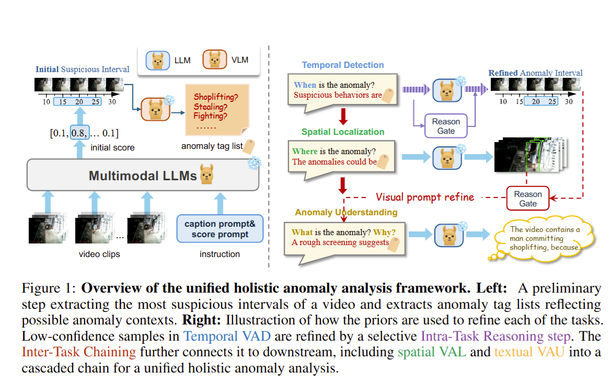

# A Unified Reasoning Framework for Holistic Zero-Shot Video Anomaly Analysis



 > [Project Page](https://rathgrith.github.io/Unified_Frame_VAA/)


## Overview

This is the code implementation for the paper [A Unified Reasoning Framework for Holistic Zero-Shot Video Anomaly Analysis (NeurIPS 2025)](https://openreview.net/pdf?id=Qla5PqFL0s). We thank the previous work for their excellent [codebase](https://github.com/lucazanella/lavad).

## Setup

### Environments

Simply run following commands:

```
conda env create -f environment.yml
conda activate VAA
```

### Dataset

We have provided preprocessed annotation files following formats in previous work (thanks to [LAVAD](https://github.com/lucazanella/lavad)) for easier setup. Before running the code, make sure you have downloaded the raw videos under ``./data/videos`` and run the provided frame extraction script to extract frames to ``./data/frames``. The extracted data should have structures like this.
```
./data/
{dataset_name}/
    annotations/
    videos/
        {video1_basename}.mp4
        {video2_basename}.mp4
        ...
    frames/
        {video1_basename}/
            frame_count000001.jpg
            frame_count000002.jpg
            ...
        {video2_basename}/
            frame_count000001.jpg
            frame_count000002.jpg
            ...
        ...
```

## Environment
Install the Python dependencies with ``pip install -r requirements.txt``. For experiment using simplest backbone model ``VideoLLaMA3-7B, Llama3.1-8B``, we recommend to use a machine with GPU Memory > 24GB.

For Llama3.1-8B model, you need to get the model from [here](https://github.com/meta-llama/llama3). Our code assumes Llama3 repo is placed under ``./libs/``. And the ``.pth`` files for model checkpoints is placed inside the repo as ``./libs/llama3/llama3.1-8b``.

That is, we expect model code/files should be organized as:

```
./libs/
    llama/
        llama/
            __init__.py
            ...
        llama3.1-8b/
            consolidated.00.pth
            params.json
            tokenizer.model
            ...
```


## Video Anomaly Detection

Here are steps to run base experiments on the temporal Video Anomaly Detection (VAD) task.

1. Precompute per-16-frame captions, call following function that produces a folder containing captions for videos.

```
python ./src/video_pre_caption.py --video_folder "./data/{dataset_name}/videos/" --index_file "./data/{dataset_name}/annotations/test.txt" --output_dir "./data/{dataset_name}/captions/{experiment_name}" --interval 10
```

This produces the captions under the specified ``output_dir``. We have provided these results in ``./data/{dataset_name}/captions/videollama3_json_results/``.

2. After you have the frame captions, you can run first-round scoring with Llama3.1-8B by ``bash scripts/query_llm_vad.sh``. Note that you need to tweak with the paths within to make sure you are using the correct captions generated by certain VLMs.

3. With the preliminary round-1 scores generated, run sliding windows to locate suspicious segments using ``python ./src/score_filter.py`` (adjust any paths inside the script to match your setup).

4. Then extract anomaly tag lists by running ``python ./src/summarize_window.py``.

5. Start score refinement by running ``bash scripts/refine_score.sh``.

6. With the refined scores, you can evaluate them by running ``bash scripts/eval.sh``.

We have provided the score/caption files for reproducing main experiments in our paper.

## Video Anomaly Localisation
To run VAL task, you need to get the annotation files from a previous [work](https://github.com/xuzero/UCFCrime_BoundingBox_Annotation). We have preprocessed the file to make the frame file naming format consistent with the codebase of [LAVAD](https://github.com/lucazanella/lavad). We have provided them as an additional file called ``Test_annotation_naming_aligned.pkl``. Saved under ``./data/ucf_crime/``.

After you have the tag list extracted, you can run a VAL run by calling script ``python src/val_priors.py``

We have provided localisation results under different prior tags in ``./data/ucf_crime/localisations/``.

## Video Anomaly Understanding

Before running VAU task, you need to get the [HIVAU-70K dataset](https://github.com/pipixin321/HolmesVAU). We use the value under key ``video_summary`` from ``HolmesVAU/HIVAU-70k/raw_annotations/ucf_database_test.json`` and ``HolmesVAU/HIVAU-70k/raw_annotations/xd_database_test.json`` and preprocessed them for easier use. We included the video summaries under ``video_summaries.json`` for each dataset's root file.

Before you start, you may need to run ``python ./src/score_filter.py`` again for refined scores to extract final anomaly score statistics. Which is necessary for score gating.

Optionally, you can draw bounding boxes for the most suspicious clips for some suspicious videos as described in InterTC steps. To do this, you can run the script: ``python src/draw_bboxes.py``, note that you need to adjust the path to have it take the UCF-crime tag list extracted previously and the finalised score statisics.

After that you can run the script to generate textual summaries for videos via ``python src/vau_priors.py``, note that you need to specify the input/output path of the priors/results. We have provided our InterTC experiment outputs along with several baselines under ``./data/{dataset_name}/understanding/``.

Once you are done, you evaluate the traditional metrics via ``python src/compute_bleu.py <ground_truth.json> <predictions.json>``. For evaluating gpt-scores, you can refer to ``gpt_score_eval.py``.


## Bibtex

```
@inproceedings{
lin2025AUR,
title={A Unified Reasoning Framework for Holistic Zero-Shot Video Anomaly Analysis},
author={Dongheng Lin, Mengxue Qu, Kunyang Han, Jianbo Jiao, Xiaojie Jin, Yunchao Wei},
booktitle={The Thirty-ninth Annual Conference on Neural Information Processing Systems},
year={2025},
url={https://openreview.net/forum?id=Qla5PqFL0s}
}
```